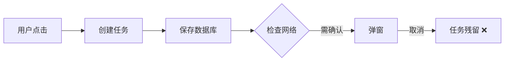
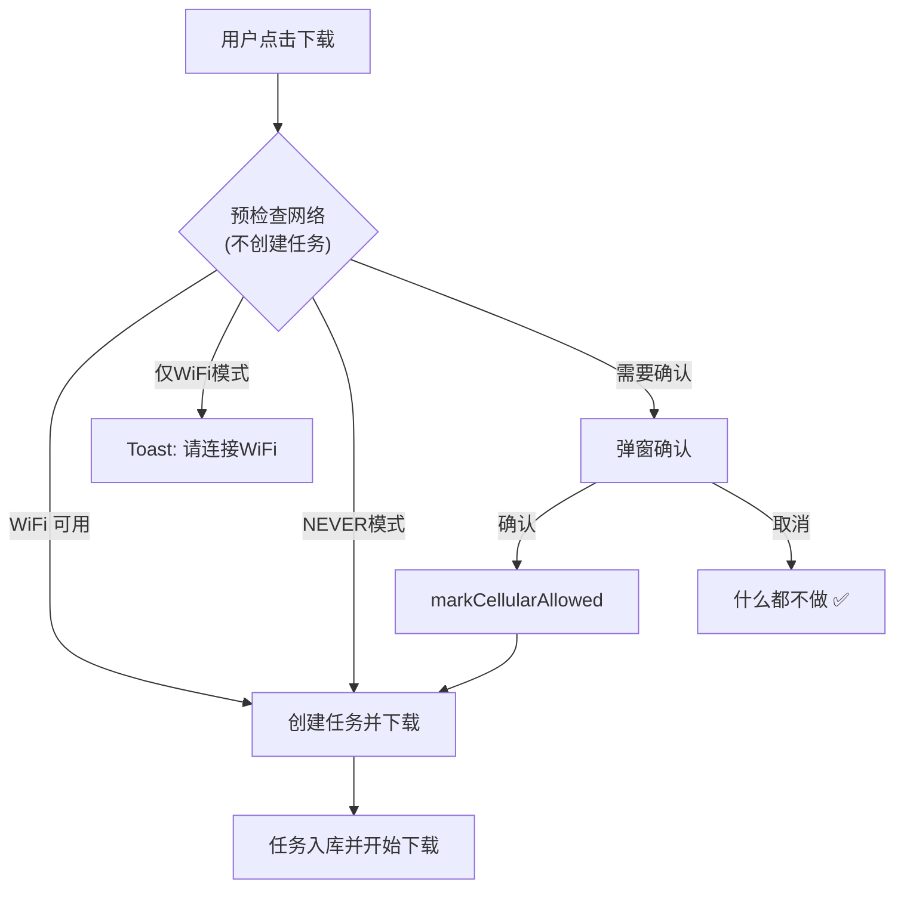

# 流量确认流程优化设计

## 问题分析

### 当前流程（有问题）



**问题**：用户还没确认，任务就已经创建并持久化，取消后留下"僵尸任务"。

---

## 新设计

### 核心原则

> **先决策，后创建任务**

### 新流程



---

## API 设计

### 新增：预检查 API

```kotlin
// NetworkRuleManager.kt
fun preCheckDownload(estimatedSize: Long): PreCheckResult

sealed class PreCheckResult {
    object Allow : PreCheckResult()                    // 可以直接下载
    object WifiOnly : PreCheckResult()                 // 需要WiFi
    data class NeedConfirmation(                       // 需要用户确认
        val totalSize: Long
    ) : PreCheckResult()
}
```

### 使用端调用方式

```kotlin
// MainViewModel.kt
fun startDownload(item: DownloadItem) {
    val result = DownloadManager.preCheckDownload(item.size)
    
    when (result) {
        is PreCheckResult.Allow -> {
            // 直接创建任务
            createAndStartDownload(item)
        }
        is PreCheckResult.WifiOnly -> {
            // 提示需要WiFi
            _uiEvent.emit(UiEvent.ShowToast("请连接WiFi"))
        }
        is PreCheckResult.NeedConfirmation -> {
            // 先保存待下载项，弹窗确认
            pendingDownloadItem = item
            _uiEvent.emit(UiEvent.ShowCellularConfirm(item.size))
        }
    }
}

fun onCellularConfirmed() {
    pendingDownloadItem?.let {
        DownloadManager.markCellularDownloadAllowed()
        createAndStartDownload(it)
        pendingDownloadItem = null
    }
}
```

---

## 改动清单

### 框架层 (downloader)

| 文件 | 改动 |
|------|------|
| `NetworkRuleManager.kt` | 新增 `preCheckDownload()` API |
| `DownloadManager.kt` | 暴露 `preCheckDownload()` 方法 |
| `DownloadManager.kt` | `onTaskCreated()` 移除弹窗决策逻辑 |

### 使用端 (app)

| 文件 | 改动 |
|------|------|
| `MainViewModel.kt` | 重构 `startDownload()` 使用预检查 |
| `MainViewModel.kt` | 添加 `onCellularConfirmed()` 回调 |
| `CellularConfirmViewModel.kt` | 简化，只做事件通信 |
| `MyDownloadDecisionCallback.kt` | 可移除（不再需要） |

---

## 对比

| 方面 | 旧设计 | 新设计 |
|------|--------|--------|
| 任务创建时机 | 点击后立即创建 | 确认后才创建 |
| 取消后状态 | 僵尸任务残留 | 无任务创建 |
| 决策层位置 | 框架层深处 | 使用端入口 |
| 回调复杂度 | 多层回调 | 简单直接 |

---

## 待确认

1. **批量下载**：多个任务一起确认，确认后一起创建
2. **恢复下载**：`resume()` 时的网络检查是否保留？
3. **后台静默下载**：是否有场景需要跳过确认？
