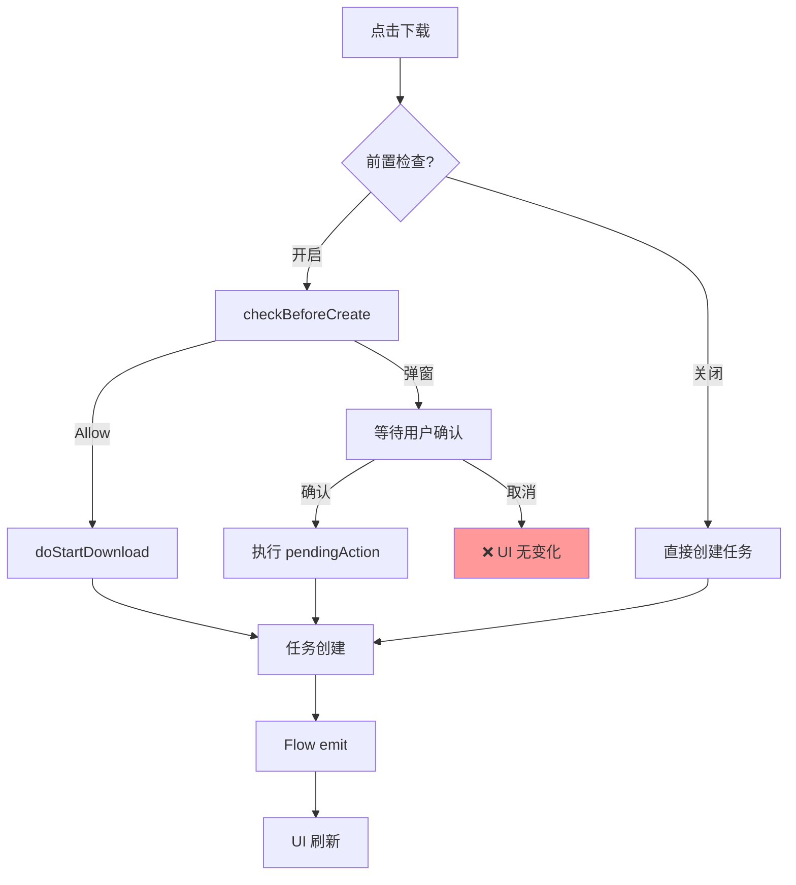

# 下载流程深度分析与问题诊断

## 一、NetworkDownloadConfig 配置说明

| 配置项 | 类型 | 默认值 | 作用 |
|--------|------|--------|------|
| `wifiOnly` | Boolean | false | 仅 WiFi 下载，流量网络拒绝 |
| `cellularPromptMode` | Enum | ALWAYS | 流量提醒模式 |
| `checkBeforeCreate` | Boolean | true | **前置检查**：任务创建前弹窗 |
| `checkAfterCreate` | Boolean | true | **后置检查**：任务创建后检查网络 |

### cellularPromptMode 枚举值

| 值 | 行为 |
|----|------|
| `ALWAYS` | 每次流量下载都弹窗确认 |
| `NEVER` | 从不弹窗，直接使用流量下载 |
| `USER_CONTROLLED` | 交给使用端判断阈值 |

---

## 二、前置检查（checkBeforeCreate）流程

```
用户点击下载
    ↓
MainActivity.startDownload()
    ↓
MainViewModel.requestDownload()
    ↓
DownloadManager.checkBeforeCreate(size)
    ↓
┌──────────────────────────────────────────┐
│ if (!config.checkBeforeCreate)           │
│     return Allow  ← 前置检查关闭直接放行  │
└──────────────────────────────────────────┘
    ↓
NetworkRuleManager.checkBeforeCreate()
    ↓
┌──────────────────────────────────────────┐
│ 判断网络状态：                            │
│ • WiFi 可用 → Allow                      │
│ • 无网络 → NoNetwork (弹窗)              │
│ • wifiOnly=true → WifiOnly (弹窗)        │
│ • 流量 + CellularSession已放行 → Allow   │
│ • 流量 + ALWAYS → NeedConfirmation       │
│ • 流量 + NEVER → Allow                   │
│ • 流量 + USER_CONTROLLED → UserControlled│
└──────────────────────────────────────────┘
```

### ⚠️ 前置检查问题

| 问题 | 原因 | 表现 |
|------|------|------|
| **CellularSession 记忆** | 一旦确认使用流量，`CellularSessionManager.isCellularDownloadAllowed()` 返回 true | 后续下载不再弹窗 |
| **UI 未同步** | 弹窗期间按钮状态不变 | 用户不知道发生了什么 |
| **取消弹窗无反馈** | `CellularConfirmViewModel.deny()` 不通知 MainActivity | 按钮仍可点击但无响应 |

---

## 三、后置检查（checkAfterCreate）流程

```
任务创建 (DownloadRequestBuilder.start())
    ↓
DownloadManager.checkAfterCreate()
    ↓
┌──────────────────────────────────────────┐
│ if (!config.checkAfterCreate)            │
│     直接入队 → 开始下载                   │
└──────────────────────────────────────────┘
    ↓
checkDownloadPermission(task)
    ↓
┌──────────────────────────────────────────┐
│ 判断结果：                                │
│ • Allow → 入队下载                        │
│ • NeedConfirmation → 暂停 + 弹窗          │
│ • Deny:NO_NETWORK → 暂停 + Toast          │
│ • Deny:WIFI_ONLY → 暂停 + showWifiOnlyHint│
│ • Deny:USER_CONTROLLED → 暂停             │
└──────────────────────────────────────────┘
```

### ⚠️ 后置检查问题

| 问题 | 原因 | 表现 |
|------|------|------|
| **双重检查冲突** | 前置和后置都开启时，可能出现前置 Allow 但后置 Deny | 用户困惑 |
| **重复弹窗** | 前置弹窗确认后，后置又弹窗 | 体验差 |

---

## 四、配置组合行为矩阵

| checkBefore | checkAfter | wifiOnly | promptMode | WiFi | 流量 | 无网络 |
|-------------|------------|----------|------------|------|------|--------|
| ✓ | ✓ | ✗ | ALWAYS | ✅直接下载 | 🔔前置弹窗 | 🔔前置弹窗 |
| ✓ | ✓ | ✓ | - | ✅直接下载 | 🔔WifiOnly弹窗 | 🔔NoNetwork弹窗 |
| ✗ | ✓ | ✗ | ALWAYS | ✅直接下载 | 🔔后置弹窗* | ⏸暂停+Toast |
| ✗ | ✗ | ✗ | - | ✅直接下载 | ✅直接下载 | ❌失败 |

> *: 后置弹窗时任务已创建，只是暂停状态

---

## 五、乐观更新问题分析

### 5.1 当前乐观更新位置

| 状态转换 | 乐观更新? | 更新内容 | 问题 |
|----------|-----------|----------|------|
| 新下载 | ❌ 无 | - | 依赖 Flow 刷新，有延迟 |
| 暂停→继续 | ✅ 有 | `item.task = task.copy(status=DOWNLOADING/WAITING)` | Flow 可能覆盖 |
| 下载中→暂停 | ✅ 有 | `setText("继续")` | 正常 |
| 等待中→暂停 | ✅ 有 | `item.task = task.copy(status=PAUSED)` | 正常 |

### 5.2 前置检查对乐观更新的影响



### 5.3 问题：新下载无乐观更新

**现状**：
```kotlin
private fun startDownload(...) {
    // 不预先更新 UI
    viewModel.requestDownload(item)  // 异步
}
```

**问题**：用户点击后无即时反馈，需等待 Flow 刷新

**建议**：
```kotlin
private fun startDownload(...) {
    // 立即显示"检查中"或禁用按钮
    vb.btnDownload.isEnabled = false
    vb.btnDownload.setText("检查中")
    viewModel.requestDownload(item)
}
```

---

## 六、建议修复方案

### 6.1 统一检查策略

建议**只保留前置检查**，关闭后置检查：
- 前置检查已经判断了网络状态
- 后置检查会导致重复判断和重复弹窗

```kotlin
val config = NetworkDownloadConfig(
    checkBeforeCreate = true,
    checkAfterCreate = false  // 关闭后置
)
```

### 6.2 新下载添加乐观更新

```kotlin
// MainActivity.startDownload()
vb.btnDownload.setText("检查中...")
vb.btnDownload.isEnabled = false
viewModel.requestDownload(item)

// ViewModel 返回后根据结果更新
sealed class DownloadEvent {
    object CheckPassed : DownloadEvent()
    object CheckFailed : DownloadEvent()
    data class DialogShown(val item: DownloadItem) : DownloadEvent()
}
```

### 6.3 弹窗取消时恢复 UI

```kotlin
// CellularConfirmDialogActivity.handleDeny()
CellularConfirmViewModel.deny()
// 发送事件通知 UI 恢复
CellularConfirmViewModel.emitCancelled(item)
```

### 6.4 CellularSession 重置策略

当前只在 WiFi 连接时重置，建议增加：
- App 返回后台超过 5 分钟
- 用户手动切换设置

---

## 七、关键代码位置

| 功能 | 文件 | 方法 |
|------|------|------|
| 配置存储 | NetworkRuleManager.kt | `loadConfig()`, `saveConfig()` |
| 前置检查 | NetworkRuleManager.kt | `checkBeforeCreate()` |
| 后置检查 | DownloadManager.kt | `checkAfterCreate()` |
| 会话管理 | CellularSessionManager.kt | `allowCellularDownload()`, `reset()` |
| UI 事件 | MainViewModel.kt | `requestDownload()`, `uiEvent` |
| 弹窗 | CellularConfirmDialogActivity.kt | `handleConfirm()`, `handleDeny()` |
